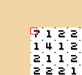

# ColoringPixelsFlood
Program that automaticly colors a picture in Coloring Pixels Game
 Requires .NET Framework 4.6.1 or later

It's really finicky and only works in fullscreen 1920x1080.
Max supported X and Y is 100x50 picture resolution.
For bigger pictures, you can do them in sectors.
Be sure to Lock Completed Pixels and 
Remove completed colors from palette in the game settings

1. Select a picture type in X, Y, num of colors and color to start with (usualy 1)
2. Scroll away with mouse 5 ticks
3. Move the picture so left-top corner is in the monitor corner
4. Hover your mouse over top-left part of the top-left pixel like so:
 
5. Hit Alt + Numpad 1

Alt + Numpad 1 - Start
 Alt + Numpad 2 - Pause
 Alt + Numpad 3 - Resume
 Alt + Numpad 4 - Skip a color

Make sure that Coloring pixels are in focus
